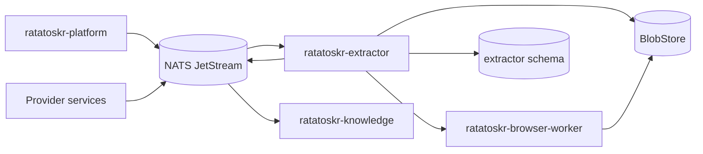
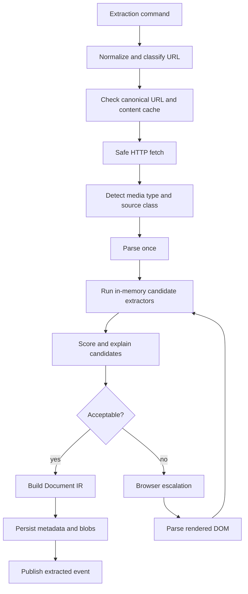

# Ratatoskr Extractor Architecture

> Status: target architecture. The service foundation, safe URL routing and fetch, parse-once HTML
> selection, Document IR, PostgreSQL/JetStream pipeline, and direct PDF extraction are implemented.
> Provider adapters, OCR, the browser worker, and broad corpus/performance work remain planned.

## 1. Purpose

`ratatoskr-extractor` converts external URLs and uploaded documents into deterministic, provenance-preserving `Document IR` records.

The repository replaces the legacy chain of overlapping scraper frameworks with one controlled pipeline:

```text
classify once
fetch once
parse once
extract several in-memory candidates
score deterministically
escalate to a browser only when justified
```

The repository contains two deployables:

- `ratatoskr-extractor` — classification, safe HTTP acquisition, HTML/PDF parsing, candidate selection, and Document IR production;
- `ratatoskr-browser-worker` — isolated Chromium rendering for jobs that require JavaScript or an explicitly approved browser context.

The extractor does not summarize content, generate embeddings, infer topics, or own social/provider accounts.

## 2. Architectural position



Provider-specific APIs route authoritative provider objects directly to their owning services. The extractor handles generic web/PDF content and explicit browser escalation.

## 3. Repository structure

```text
ratatoskr-extractor/
├── crates/
│   ├── extractor-domain/
│   ├── url-routing/
│   ├── safe-fetch/
│   ├── html-parser/
│   ├── pdf-parser/
│   ├── candidate-extractors/
│   ├── quality-scoring/
│   ├── document-ir/
│   ├── browser-protocol/
│   ├── blob-adapter/
│   ├── persistence/
│   ├── telemetry/
│   └── test-support/
├── services/
│   ├── extractor/
│   └── browser-worker/
├── schema.sql
├── fixtures/
│   ├── golden-corpus/
│   └── malformed/
├── benchmarks/
├── tests/
└── docs/
```

Browser dependencies stay outside the deterministic parsing core.

## 4. Bounded context and owned data

The extractor owns:

- normalized URL observations;
- fetch attempts and response metadata;
- raw-body and rendered-DOM blob references;
- extraction attempts and candidate metrics;
- selected extraction result;
- canonical Document IR and content hash;
- host strategy statistics;
- browser escalation records;
- extraction-specific outbox/inbox state.

Recommended schema:

```text
extractor.urls
extractor.fetches
extractor.documents
extractor.extraction_runs
extractor.candidates
extractor.host_strategies
extractor.browser_jobs
extractor.outbox
extractor.inbox
```

It does not own summaries, embeddings, user collections, provider credentials, GitHub metadata, or social saved-state semantics.

## 5. End-to-end pipeline



Each stage produces structured evidence and a bounded error class.

## 6. URL normalization and routing

### 6.1. Normalization

Normalization preserves the original URL and derives a canonical request candidate:

- lowercase scheme and host;
- normalize default ports;
- remove known tracking parameters;
- preserve semantically meaningful query parameters;
- normalize internationalized hostnames;
- resolve relative redirect locations safely;
- retain redirect history;
- derive a stable URL fingerprint.

Canonicalization is evidence-based. A page-provided canonical URL is not trusted until it passes the same URL policy.

### 6.2. Routing

Routing occurs before generic HTML extraction.

Examples:

```text
GitHub repository URL -> ratatoskr-github
X post URL -> ratatoskr-x
Instagram URL -> ratatoskr-instagram
Threads URL -> ratatoskr-threads
Reddit or Hacker News -> source adapter when available
YouTube -> transcript/media adapter
PDF or document MIME -> document parser
generic HTTP(S) -> web extraction pipeline
```

Routing prevents generic scraping from replacing authoritative provider APIs.

## 7. Safe fetch architecture

### 7.1. Request controls

The fetcher uses `reqwest` with `rustls` and enforces:

- supported schemes only;
- DNS and IP policy checks;
- redirect-hop validation;
- maximum redirects;
- connection, first-byte, idle, and total timeouts;
- compressed and decompressed body limits;
- content-type validation and sniffing;
- per-host and global concurrency budgets;
- response streaming and incremental hashing;
- cancellation propagation;
- conditional requests using ETag and Last-Modified;
- explicit user agent and accepted encodings;
- bounded retry for transient failures.

### 7.2. SSRF policy

Every initial and redirected destination is checked against policy.

Blocked by default:

- loopback;
- link-local;
- private network ranges;
- cloud metadata endpoints;
- Unix/file/data schemes;
- DNS rebinding to blocked addresses;
- userinfo-based URL ambiguity.

DNS failure, policy denial, timeout, TLS failure, and HTTP failure are distinct error classes.

### 7.3. Resource accounting

Each run records:

- outbound requests;
- redirect count;
- compressed and decompressed bytes;
- elapsed network time;
- retry count;
- cache outcome;
- cancellation state.

These metrics feed host policy and capacity planning.

## 8. Parsing architecture

### 8.1. HTML

HTML is parsed once with a standards-compatible parser. Candidate extractors operate on the shared DOM.

Candidate strategies:

- Readability-compatible extraction;
- semantic `<article>` and `<main>` extraction;
- text-density segmentation;
- publisher-specific selectors;
- JSON-LD `articleBody` extraction;
- source-specific adapters.

A candidate consists of structured blocks, metadata, metrics, warnings, and provenance references.

### 8.2. PDF

PDF parsing is isolated behind a parser interface and returns:

- page-aware text blocks;
- headings when inferable;
- tables or table references;
- images and captions when supported;
- document metadata;
- page-level provenance;
- parse warnings.

OCR is not the default path. It is a separate, explicitly budgeted fallback for image-only pages.

### 8.3. Other documents

Additional formats are adapters with explicit MIME allowlists and resource limits. Archive containers are never recursively unpacked without a dedicated safe-import contract.

## 9. Candidate scoring

The scorer is deterministic and versioned.

Representative features:

- text length and paragraph count;
- text-to-DOM ratio;
- link density;
- boilerplate ratio;
- title/body consistency;
- duplicate block ratio;
- sentence distribution;
- navigation/footer markers;
- error, consent, login, and paywall markers;
- metadata completeness;
- suspicious truncation;
- language consistency;
- code/table/media balance.

The selected result includes an explanation:

```text
extractor: readability
score: 0.87
words: 1842
link_density: 0.03
boilerplate_ratio: 0.08
browser_required: false
warnings: []
```

Thresholds are configuration tied to a scorer version and calibrated on the golden corpus.

## 10. Document IR

The canonical output is the shared structured document contract. Its shape is owned by
`ratatoskr-contracts` (milestone 5, `docs/ARCHITECTURE.md` section 6.1); the copy below tracks that
definition and is not an independent one.

```rust
pub struct Document {
    pub document_id: DocumentId,
    pub metadata: DocumentMetadata,
    pub blocks: Vec<Block>,
    pub provenance: Vec<SourceSpan>,
    pub content_hash: String,
    pub document_ir_version: u32,
}
```

The version field is `document_ir_version`, not `schema_version`. In Ratatoskr `schema_version` means
the envelope major and nothing else, and the contracts field lint rejects that name on any contract
other than the event envelope.

The identity of the extraction engine is provenance, not document content: it is carried in
`SourceSpan` with the extraction strategy, per contracts section 6.2. The canonical document must not
embed extraction-engine implementation details.

IR requirements:

- preserve reading order;
- retain headings, paragraphs, lists, quotes, code, tables, and images;
- preserve unknown block types rather than discard data;
- attach source provenance at block or span granularity;
- normalize text without rewriting meaning;
- keep raw HTML/PDF separately in BlobStore;
- generate Markdown, sanitized HTML, plain text, and LLM context as derived views.

A new renderer must not require refetching the source.

## 11. Browser worker architecture

### 11.1. Escalation criteria

Browser rendering is used only when:

- the fetched HTML is a JavaScript shell;
- meaningful content appears after hydration;
- a known host strategy requires rendering;
- the deterministic score remains below threshold;
- an explicitly authorized user context is needed and allowed.

Browser launch is not a generic race against HTTP extraction.

### 11.2. Isolation

The browser worker:

- runs as a separate process/service identity;
- uses a reusable Chromium process with isolated contexts per job;
- blocks images, fonts, video, ads, and trackers when unnecessary;
- enforces CPU, memory, network, navigation, and total time limits;
- restricts downloads and external protocol handlers;
- returns rendered DOM, final URL, response evidence, and diagnostics;
- stores artifacts through scoped blob credentials;
- never runs LLM interpretation.

Provider session profiles, if ever supported, are separate consented resources and never shared across users or generic jobs.

### 11.3. Browser protocol

The extractor submits a versioned job containing:

- URL and allowed redirect policy;
- resource policy;
- timeout and budget;
- optional approved session profile reference;
- correlation and operation IDs.

The worker returns a versioned result or bounded failure. Duplicate job delivery is safe.

## 12. Caching and host strategy

### 12.1. Content cache

Cache keys distinguish:

- normalized URL;
- relevant request headers;
- authenticated versus public context;
- fetch strategy version.

Content hashes deduplicate identical bodies across URLs while retaining observation provenance.

### 12.2. Host strategy cache

Per-host observations include:

```text
preferred_strategy
success_rate
median_quality
p50_latency
p95_latency
browser_escalation_rate
last_failure_class
expires_at
```

Strategy is advisory and expires. It cannot bypass current SSRF or security policy.

## 13. Commands and events

### 13.1. Commands consumed

```text
content.capture.requested.v1
content.document.reextract_requested.v1
content.browser_render_requested.v1
```

### 13.2. Events emitted

```text
content.fetch.completed.v1
content.document.extracted.v1
content.document.unchanged.v1
content.document.failed.v1
content.browser.escalated.v1
```

Events reference documents and blobs; they do not embed large raw bodies.

At-least-once delivery requires inbox deduplication and repeatable persistence transitions.

## 14. Failure model

Permanent failures:

- unsupported scheme or media type;
- SSRF policy denial;
- body exceeds hard limits;
- explicit authentication wall without approved context;
- structurally invalid document beyond parser recovery.

Transient failures:

- network timeout;
- DNS or TLS instability;
- retryable HTTP status;
- browser capacity exhaustion;
- storage or event bus unavailability.

Low quality is not automatically a transport failure. The result may be stored with warnings and an explicit quality state.

## 15. Performance architecture

The primary optimization is removal of duplicate network and browser work, not merely rewriting Python in Rust.

Budgets are enforced for:

- concurrent HTTP requests;
- per-host concurrency;
- response bytes;
- DOM nodes;
- parser CPU time;
- browser jobs;
- browser memory;
- BlobStore throughput;
- queue age.

CPU-heavy parsing and scoring use a bounded blocking/Rayon pool so Tokio I/O workers remain responsive.

Hedged requests are permitted only as measured, delayed, low-cost strategies. Multiple expensive browser or remote extraction providers do not race by default.

## 16. Persistence and blob layout

PostgreSQL stores metadata, state, hashes, metrics, and blob references. BlobStore stores:

```text
raw HTTP body
original HTML
rendered HTML
PDF/document bytes
parser diagnostics when approved
canonical Document IR snapshot
derived renderings when useful
```

Raw evidence is immutable. A new extraction version creates a new run and selected result rather than silently overwriting history.

## 17. Security boundaries

- No provider credentials in the deterministic extractor.
- Browser worker receives only scoped, short-lived profile references when explicitly approved.
- Active HTML is never served unsanitized to clients.
- File names and URLs never become unvalidated filesystem paths.
- Parsers run with resource limits and treat input as hostile.
- External entities, scripts, plugins, and protocol handlers are disabled or isolated.
- Logs contain metadata and hashes, not full article bodies or private documents.
- Blob access uses opaque references and least-privilege credentials.
- Redirect and DNS checks are repeated at every network boundary.

## 18. Observability

Required telemetry:

```text
extraction_requests_total
extraction_duration_seconds
fetch_bytes_total
fetch_retries_total
ssrf_denials_total
candidate_quality_score
browser_escalation_total
browser_job_duration_seconds
browser_job_failures_total
cache_hits_total
document_word_count
queue_lag_seconds
```

Traces include stage spans and correlation IDs. Metrics use bounded host categorization rather than unbounded raw URLs.

## 19. Testing architecture

### Unit and property tests

- URL normalization and redirect policy;
- IP/range classification;
- decompression and body limits;
- DOM candidate extraction;
- deterministic score stability;
- Document IR serialization;
- state transitions and idempotency.

### Fuzzing

- malformed URLs;
- hostile HTML;
- parser edge cases;
- oversized or nested structures;
- malformed metadata and encodings.

### Golden corpus

The corpus covers static articles, SPAs, malformed pages, paywalls, multiple languages, code-heavy pages, tables, long reads, PDFs, deleted/error pages, and anti-bot responses.

Measured outcomes:

- completeness;
- boilerplate rate;
- p50/p95 latency;
- outbound requests per URL;
- browser launches per URL;
- downloaded bytes;
- CPU seconds;
- peak memory;
- extraction cost.

### Workspace integration

- capture command through Platform;
- BlobStore persistence;
- browser escalation;
- event delivery to Knowledge;
- replay and duplicate-command behavior;
- legacy/new shadow comparison.

## 20. Deployment architecture

The extractor and browser worker deploy separately.

```text
extractor:
  outbound HTTP access under egress policy
  extractor database role
  BlobStore read/write scope
  content command/event subjects

browser-worker:
  isolated runtime and filesystem
  Chromium dependencies
  no database access unless strictly required
  scoped BlobStore access
  browser job subjects only
```

The browser worker can be omitted from profiles that process only static HTML/PDF content.

## 21. Migration and shadow mode

Migration from the legacy scraper chain uses dual processing:

1. Submit the same URL to legacy and Rust pipelines.
2. Persist comparable metrics and normalized hashes.
3. Serve legacy results until a source class meets quality criteria.
4. Cut over static HTML, PDFs, provider APIs, common SPAs, then browser-required hosts.
5. Preserve rollback by retaining legacy routing until each class is stable.

Comparison focuses on completeness, boilerplate, latency, resource use, and browser rate rather than exact Markdown equality.

## 22. Architectural invariants

1. Ordinary extraction performs one network fetch and one DOM parse.
2. Candidate strategies share the parsed source.
3. Document IR is canonical; Markdown is derived.
4. Browser rendering is isolated and demand-driven.
5. LLMs never decide deterministic extraction output.
6. Every redirect is revalidated against SSRF policy.
7. Raw evidence is retained separately from normalized output.
8. Provider APIs are preferred for authoritative provider content.
9. Unknown blocks and parser warnings are preserved.
10. Resource budgets are explicit and observable.
11. Delivery is at-least-once and handlers are idempotent.
12. Quality decisions are versioned and explainable.

## 23. Evolution

Initial milestones:

1. Shared Document IR and safe URL/fetch foundations.
2. Static HTML parser with multiple in-memory candidates.
3. Deterministic quality scoring and golden corpus.
4. PDF parsing and page provenance.
5. BlobStore and event integration.
6. Browser worker and escalation protocol.
7. Host strategy cache and conditional fetching.
8. Shadow comparison against the legacy chain.
9. Source-class cutovers and removal of redundant scraper frameworks.

Changes to canonical IR, SSRF policy, or browser-session support require ADRs and coordinated contract updates.
